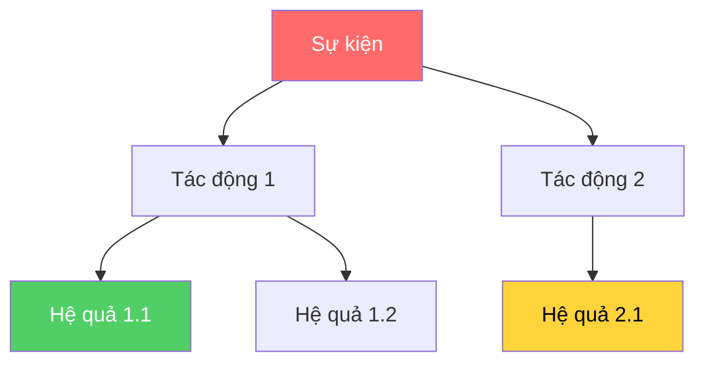

# alphaear-logic-visualizer

## Mô tả
Tự động vẽ sơ đồ chuỗi truyền dẫn tác động (impact transmission chain), giải thích trực quan cách một sự kiện ảnh hưởng tới thị trường. Xuất ra format Draw.io hoặc Mermaid diagram.

## Khi nào dùng
- Giải thích cơ chế truyền dẫn của một sự kiện macro (Fed tăng lãi, CPI, GDP...)
- Vẽ sơ đồ luận điểm đầu tư (investment thesis)
- Trình bày phân tích cho stakeholder bằng hình ảnh thay vì văn bản
- Mapping rủi ro và chuỗi nhân quả trong danh mục

## Hướng dẫn

### Cấu trúc sơ đồ truyền dẫn
```
[Sự kiện gốc] 
    → [Tác động trực tiếp 1] → [Hệ quả tiếp theo]
    → [Tác động trực tiếp 2] → [Hệ quả tiếp theo]
    → [Tác động gián tiếp]   → ...
```

### Ví dụ: Fed tăng lãi suất 50bps
```
[Fed +50bps]
  ├─→ [USD mạnh lên]
  │     ├─→ [Hàng hoá USD giảm]
  │     └─→ [EM currencies yếu]
  ├─→ [Bond yield tăng]
  │     ├─→ [Định giá cổ phiếu tăng trưởng giảm]
  │     └─→ [P/E compress → tech sell-off]
  └─→ [Chi phí vay tăng]
        ├─→ [Real estate cooling]
        └─→ [SME earnings pressure]
```

### Format Mermaid (dùng trong Markdown)
Khi xuất ra Mermaid:


### Format Draw.io
Khi xuất ra Draw.io XML để import:
- Cung cấp XML đầy đủ có thể paste vào drawio.com
- Dùng màu sắc chuẩn: đỏ (negative), xanh (positive), vàng (neutral/uncertain)

### Màu sắc quy ước
| Màu | Ý nghĩa |
|---|---|
| 🔴 Đỏ | Tác động tiêu cực |
| 🟢 Xanh | Tác động tích cực |
| 🟡 Vàng | Không chắc chắn / trung lập |
| 🔵 Xanh dương | Sự kiện gốc |

### Ứng dụng cho thị trường Việt Nam
- Sơ đồ truyền dẫn từ tỷ giá USD/VND → xuất khẩu → lạm phát
- Chuỗi tác động từ lãi suất SBV → bất động sản → ngân hàng
- Phân tích tác động chính sách thuế/phí lên ngành cụ thể

## Đầu vào cần thiết
- Mô tả sự kiện cần phân tích
- Thị trường / ngành / tài sản quan tâm
- Format xuất ra: Mermaid (default), Draw.io XML, hoặc ASCII text

## Lưu ý
- Trung lập về thị trường: dùng được với dữ liệu Việt Nam
- Độ phức tạp sơ đồ: giữ ≤ 3 cấp độ để dễ đọc
- Luôn ghi chú giả định ở các nút có nhiều hướng tác động
