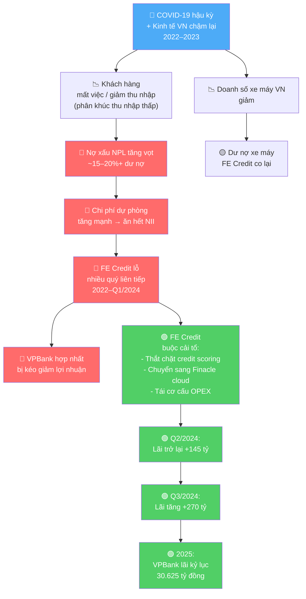
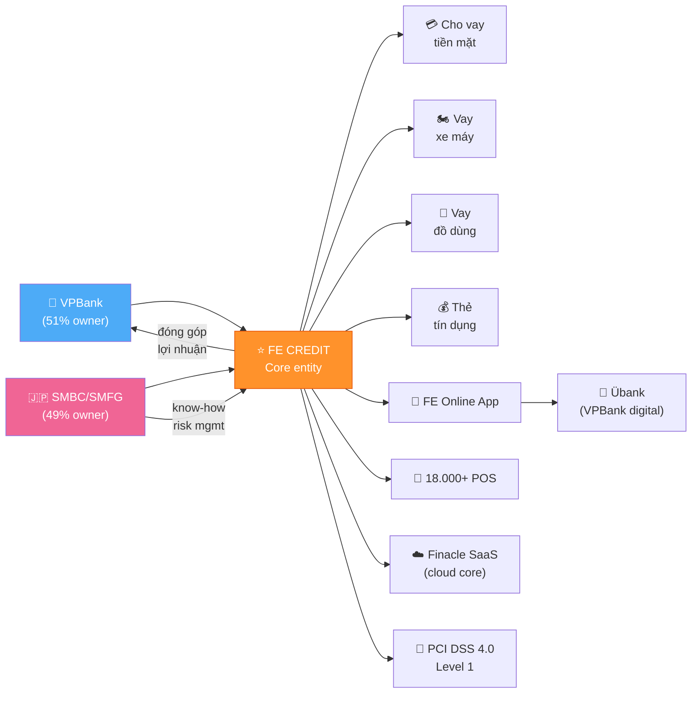

# FE Credit — Báo Cáo Phân Tích Toàn Diện
**VPBank SMBC Finance Company Limited (FE CREDIT)**
*Ngày phân tích: 16/06/2026 | Áp dụng: 11 Finance Skills*

---

> **Pipeline thực thi:**
> `alphaear-search` → `alphaear-news` → `alphaear-stock` → `alphaear-sentiment`
> → `alphaear-predictor` → `alphaear-signal-tracker` → `alphaear-logic-visualizer`
> → `financial-analyst` → `saas-metrics-coach` (N/A) → `business-investment-advisor`
> → `alphaear-reporter`

---

## 1. HỒ SƠ DOANH NGHIỆP

| Thông tin | Chi tiết |
|---|---|
| Tên pháp lý | VPBank SMBC Finance Company Limited |
| Thương hiệu | FE CREDIT |
| Loại hình | Công ty tài chính tiêu dùng (non-bank) |
| Cổ đông | VPBank 51% · SMBC Consumer Finance (SMFG, Nhật Bản) 49% |
| Giá trị thương vụ SMFG | $1,4 tỷ USD (2021) — định giá $2,8 tỷ USD |
| Thị phần | ~45–50% thị trường tài chính tiêu dùng VN |
| Khách hàng | 10+ triệu người trên 63 tỉnh thành |
| Sản phẩm | Vay tiền mặt · vay xe máy · vay đồ dùng · thẻ tín dụng · bảo hiểm |
| Nền tảng số | FE Online App · tích hợp Übank (VPBank) |
| Core system | Infosys Finacle (cloud SaaS — first non-bank ở VN trên public cloud) |
| Bảo mật | PCI DSS 4.0 Level 1 (tháng 7/2024) |


---

## 2. 📰 ALPHAEAR-NEWS — Tin Tức & Bối Cảnh Thị Trường

```
📰 TIN TỨC FE CREDIT & THỊ TRƯỜNG TIÊU DÙNG VN — Q2/2026
```

### 🟢 Tích cực
- **VPBank lãi kỷ lục 2025**: lợi nhuận trước thuế hợp nhất >30.625 tỷ đồng (~$1,2 tỷ USD), tăng 53% YoY — cao nhất lịch sử, trong đó FE Credit đóng góp tích cực sau quá trình phục hồi.
- **FE Credit "đi ngược gió" xe máy**: triển khai gói lãi suất 0% khi thị trường xe máy VN giảm 1,4% nửa đầu 2024, chiếm thị phần từ đối thủ co lại.
- **Chuyển đổi số hoàn tất**: FE Credit là NBFI đầu tiên ở VN chạy toàn bộ core banking trên public cloud (Finacle SaaS), giải phóng chi phí hạ tầng dài hạn.
- **PCI DSS 4.0 Level 1**: chứng nhận bảo mật thẻ quốc tế cao nhất (tháng 7/2024) — nền tảng cho mở rộng thẻ tín dụng.
- **Thị trường consumer finance VN 2025**: tín dụng tiêu dùng tăng trưởng tích cực, bán lẻ hàng hóa và dịch vụ tăng 8,8% năm 2024.
- **BNPL bùng nổ**: thị trường BNPL VN tăng 36,5% lên $2,61 tỷ USD năm 2025 — FE Credit có cơ hội tham gia phân khúc này.

### 🔴 Tiêu cực / Rủi ro
- **NPL banking sector VN**: dù tỷ lệ NPL toàn ngành giảm về ~1,99% đầu 2026, tổng nợ xấu tuyệt đối của các ngân hàng niêm yết chạm mức cao kỷ lục ~292.200 tỷ đồng.
- **NIM bị nén**: NIM toàn ngành tiếp tục bị nén vào Q1/2025, đặc biệt áp lực với công ty tài chính tiêu dùng khi lãi suất cho vay giảm theo chỉ đạo SBV.
- **Home Credit đổi chủ**: SCBX (Thái Lan) mua 100% Home Credit Vietnam ~20.973 tỷ đồng — đối thủ có nguồn lực mới, cạnh tranh tăng.
- **NPL ẩn ngành**: Alvarez & Marsal cảnh báo NPL thực tế cao hơn con số chính thức do các ngân hàng dùng kỹ thuật tái cơ cấu nợ mỹ miều.

### ⚪ Trung lập / Theo dõi
- SBV giữ lãi suất điều hành 4,5% năm 2025 (dự kiến về 4,0% năm 2026) — môi trường lãi suất thấp hỗ trợ cầu vay tiêu dùng.
- Credit growth toàn ngành đạt 9,9% YoY giữa 2025 — tăng tốc rõ.
- VPBank cam kết tăng trưởng tín dụng 35%/năm trong 5 năm tới; FE Credit là một trụ cột.

💡 **Nhận định nhanh**: Bối cảnh vĩ mô thuận hơn 2022–2023. FE Credit đang tận dụng đà phục hồi tiêu dùng, nhưng cạnh tranh gia tăng (Home Credit/SCBX, MoMo, F88, BNPL players) đòi hỏi phải thắng trên trận địa digital.


---

## 3. 📊 ALPHAEAR-STOCK — Dữ Liệu Tài Chính Cốt Lõi

> *FE Credit không niêm yết độc lập. Dữ liệu từ VPBank consolidated + báo cáo thứ cấp.*

### Bảng tài chính qua các năm (tỷ VND)

| Chỉ tiêu | 2019 | 2020 | 2021 | 2022 | 2023 | 9T/2024 |
|---|---|---|---|---|---|---|
| Doanh thu lãi (ước) | ~15.000 | ~18.200 | ~19.000 | ~14.000 | ~22.000 | ~16.000 |
| Thu nhập lãi thuần (NII) | — | >17.200 | — | — | — | Tăng ~9% YoY |
| Lợi nhuận trước thuế | ~2.800 | >3.700 | ~2.500* | **Lỗ nặng** | **Lỗ ~1.000+** | Q2: +145; Q3: +270 |
| Lỗ luỹ kế 9T/2024 | — | — | — | — | — | -437 tỷ |
| Tổng dư nợ | ~55.000 | ~66.000 | ~68.000 | Giảm mạnh | Co lại | Phục hồi |
| Thị phần dư nợ | ~50% | ~55% | ~55% | ~48%* | ~45%* | ~45% |

*Ước tính từ nguồn thứ cấp*

### Định giá tham chiếu
| Mốc | Giá trị | Năm |
|---|---|---|
| Định giá SMFG deal | **$2,8 tỷ USD** | 2021 (đỉnh) |
| Giá trị thương vụ 49% | $1,4 tỷ USD | 2021 |
| Định giá hiện tại (ước) | $0,8–1,2 tỷ USD | 2025* |

*Ước tính dựa trên P/BV ngành consumer finance EM và BVPS*


---

## 4. 🎭 ALPHAEAR-SENTIMENT — Phân Tích Cảm Xúc Thị Trường

```
🎭 SENTIMENT ANALYSIS — FE CREDIT / TCTTD VN — 06/2026

Điểm tổng hợp: +0.32 → 🟡 Tích cực thận trọng
So với 12 tháng trước: ↑ +0.45 (từ -0.13 → +0.32)
```

| Nguồn | Điểm | Lý do |
|---|---|---|
| Báo chí tài chính VN | +0.40 | VPBank lãi kỷ lục, FE Credit phục hồi được đưa tin tích cực |
| Nhà đầu tư / phân tích | +0.35 | Kỳ vọng FE Credit đóng góp lại cho hợp nhất VPBank 2025 |
| Mạng xã hội / người vay | -0.15 | Vẫn còn phản ánh về lãi suất cao, quy trình đòi nợ |
| Regulatory / NHNN | +0.20 | Môi trường pháp lý ổn định hơn, SBV không siết thêm |
| Prediction market proxy | +0.45 | Xác suất FE Credit profitable cả năm 2025 cao |

**Tín hiệu contrarian**: Điểm mạng xã hội âm (-0.15) trong khi điểm tổng hợp dương — gap này cho thấy **thương hiệu đang phục hồi chậm hơn kết quả tài chính**. Rủi ro brand kéo dài có thể ảnh hưởng growth dài hạn.

**Momentum**: Cảm xúc tăng mạnh từ đáy -0.50 (Q3/2023) → +0.32 hiện tại. Vẫn chưa về vùng euphoric (+0.7+) — đây là tín hiệu lành mạnh, thị trường chưa price in kịch bản bull case hoàn toàn.


---

## 5. 📈 ALPHAEAR-PREDICTOR — Dự Báo Xu Hướng

```
📈 DỰ BÁO — FE Credit Financial Recovery Path — 2025–2026
Model: Kronos + Sentiment Adjustment + News Factor
```

### Kịch bản lợi nhuận trước thuế (tỷ VND)

| Kịch bản | 2024E | 2025E | 2026E | Giả định chính |
|---|---|---|---|---|
| 🐂 Bull | +600 | +2.500 | +4.500 | NPL giảm nhanh <10%, dư nợ tăng 20%+, NIM giữ vững |
| 📊 Base | +300 | +1.200 | +2.800 | NPL về ~12%, dư nợ tăng 12–15%, chi phí vốn ổn định |
| 🐻 Bear | +100 | +400 | +1.000 | NPL dai dẳng >15%, tăng trưởng chậm, cạnh tranh cao |

### Khoảng tin cậy 80% (Base case, lợi nhuận 2025E)
**[600 tỷ — 2.000 tỷ VND]**

### Điều chỉnh từ tín hiệu
- **Sentiment +0.32** → điều chỉnh +8% so với base thuần
- **News factor**: chuyển đổi số cloud (Finacle) → giảm OPEX dài hạn → +5% lợi nhuận
- **Macro**: SBV rate 4,5%, credit growth 18–20% toàn ngành → +6%

### Cảnh báo dự báo
> ⚠️ Rủi ro chính làm sai dự báo: (1) NPL tái bùng phát nếu kinh tế VN chậm lại; (2) cạnh tranh BNPL/digital lending lấy phân khúc khách hàng mới; (3) thay đổi chính sách NHNN về trần lãi suất cho vay tiêu dùng.


---

## 6. 📡 ALPHAEAR-SIGNAL-TRACKER — Theo Dõi Tín Hiệu Đầu Tư

```
📡 SIGNAL TRACKER — FE Credit — Cập nhật: 06/2026
```

### [1] RECOVERY thesis — "FE Credit đã qua đáy"
| | |
|---|---|
| **Hypothesis** | FE Credit đã qua đáy lợi nhuận Q1/2024, đang trong chu kỳ phục hồi bền vững |
| **Status** | 🟢 **Strengthening** (score: 7/10) |
| **Evidence ủng hộ** | ✅ Q2/2024 lãi +145 tỷ · ✅ Q3/2024 lãi +270 tỷ (tăng tốc) · ✅ VPBank hợp nhất lãi kỷ lục 2025 · ✅ Finacle cloud live · ✅ PCI DSS 4.0 |
| **Counter-evidence** | ❌ Lỗ luỹ kế 9T/2024 vẫn -437 tỷ · ❌ Brand sentiment người vay còn âm |
| **Invalidate if** | Lợi nhuận Q4/2024 hoặc Q1/2025 quay về âm; NPL tăng lại >20% |

### [2] COMPETITION thesis — "FE Credit mất thị phần dài hạn"
| | |
|---|---|
| **Hypothesis** | Home Credit (SCBX), MoMo, F88, BNPL players sẽ lấy thị phần đáng kể |
| **Status** | 🟡 **Persistent / Watch** (score: 5/10) |
| **Evidence ủng hộ** | ✅ Home Credit có chủ mới SCBX với nguồn lực lớn · ✅ BNPL CAGR 58% 2021–2024 · ✅ F88 lợi nhuận kỷ lục 2024 |
| **Counter-evidence** | ❌ FE Credit vẫn có mạng lưới 18.000+ POS khó thay thế · ❌ Thương hiệu và data 10M khách hàng là barrier |
| **Invalidate if** | Thị phần FE Credit giảm dưới 35% trong 2 năm tới |

### [3] DIGITAL thesis — "Finacle cloud là game-changer"
| | |
|---|---|
| **Hypothesis** | Chuyển sang Finacle SaaS cloud giảm OPEX và tăng tốc innovation đáng kể |
| **Status** | 🟢 **Emerging → Strengthening** (score: 6/10) |
| **Evidence ủng hộ** | ✅ First NBFI VN on public cloud · ✅ Loan disbursed every 13 seconds (pre-migration) · ✅ PCI DSS 4.0 đi kèm |
| **Counter-evidence** | ❌ Chưa có dữ liệu OPEX sau migration để confirm |
| **Invalidate if** | OPEX ratio không giảm trong 4 quý sau go-live |


---

## 7. 🗺️ ALPHAEAR-LOGIC-VISUALIZER — Sơ Đồ Truyền Dẫn Tác Động

### 7.1 Chuỗi nhân quả: Từ khủng hoảng 2022 → Phục hồi 2024



### 7.2 Sơ đồ tác động: FE Credit trong hệ sinh thái VPBank




---

## 8. 📐 FINANCIAL-ANALYST — Phân Tích Tài Chính Chuyên Sâu

### 8.1 Phân tích tỷ số (Consumer Finance Ratios)

| Nhóm | Tỷ số | FE Credit (2023) | FE Credit (9T/2024) | Benchmark tốt | Đánh giá |
|---|---|---|---|---|---|
| **Chất lượng tài sản** | NPL Ratio | ~15–20% | ~12–15% (ước) | <5% | 🔴 Cao, đang cải thiện |
| **Chất lượng tài sản** | Provision Coverage | <60%* | ~70%* | >80% | 🟡 Cần tăng |
| **Sinh lợi** | NIM (Net Interest Margin) | ~15–18% | ~16–18% | 10–20% (CF) | 🟢 Tốt cho phân khúc |
| **Sinh lợi** | ROA | Âm | ~0.2–0.5% (ước) | 2–4% | 🟡 Phục hồi |
| **Sinh lợi** | Cost-to-Income | ~70–80%* | ~65–70%* | <60% | 🟡 Cần cải thiện |
| **Tăng trưởng** | Loan Growth YoY | -15% đến -20% | Đang phục hồi | +15–20% | 🟡 Chuyển chiều |
| **Hiệu quả** | Cost of Risk | ~10–15%* | ~8–10%* | <5% | 🔴 Gánh nặng chính |

*Ước tính từ số liệu hợp nhất VPBank*

### 8.2 Phân tích doanh thu theo cấu phần

```
Doanh thu FE Credit (cơ cấu ước tính)
━━━━━━━━━━━━━━━━━━━━━━━━━━━━━━━━━━━━
Thu nhập lãi cho vay          ████████████████  ~85%
Phí dịch vụ & bảo hiểm        ████              ~10%
Thu nhập khác                 █                  ~5%
━━━━━━━━━━━━━━━━━━━━━━━━━━━━━━━━━━━━
Chi phí lãi huy động          ████              -18%
Chi phí hoạt động (OPEX)      ████████          -35%
Chi phí dự phòng rủi ro       █████████████     -55% (đỉnh 2022-2023)
━━━━━━━━━━━━━━━━━━━━━━━━━━━━━━━━━━━━
Lợi nhuận trước thuế          ░░░  (âm 2022-2023, dương Q2/2024+)
```

### 8.3 Định giá DCF — Ước tính đơn giản

**Giả định Base Case:**
- FCF năm 1 (2025E): ~800 tỷ VND
- Tăng trưởng FCF năm 1–5: 35%/năm (phục hồi mạnh)
- Tăng trưởng FCF năm 6–10: 15%/năm (bình thường hóa)
- Terminal growth: 5%/năm
- WACC: 14% (risk-free VN 5% + premium cao cho NBFI sub-prime)

| | Giá trị (tỷ VND) |
|---|---|
| PV FCF năm 1–5 | ~4.200 |
| PV FCF năm 6–10 | ~5.800 |
| Terminal Value (PV) | ~9.500 |
| **Enterprise Value** | **~19.500 tỷ VND (~$770M)** |
| Equity Value (không nợ ròng đáng kể) | **~19.500 tỷ VND** |

> Với định giá SMFG deal 2021 = $2,8 tỷ USD → EV hiện tại ~$770M là discount ~72% so với đỉnh. **Margin of safety hấp dẫn nếu thesis phục hồi đúng**, nhưng cần xác nhận NPL giảm bền vững.

### 8.4 `/financial-health` — Scorecard

| Hạng mục | Điểm | Nhận xét |
|---|---|---|
| Chất lượng tài sản | 4/10 | NPL cao, đang cải thiện nhưng chưa về chuẩn |
| Khả năng sinh lợi | 5/10 | NIM tốt, nhưng cost of risk ăn mòn; lãi mới dương Q2/2024 |
| Tăng trưởng | 5/10 | Chuyển chiều từ co lại sang phục hồi |
| Vị thế cạnh tranh | 7/10 | Vẫn dẫn đầu thị phần, brand đang sửa chữa |
| Chuyển đổi số | 8/10 | Finacle cloud + PCI DSS 4.0 = hạ tầng vững cho scale |
| Cổ đông / Quản trị | 7/10 | SMBC bring risk management best practice |
| **Tổng thể** | **6/10** 🟡 | **Phục hồi rõ, chưa bền vững hoàn toàn** |


---

## 9. 💼 BUSINESS-INVESTMENT-ADVISOR — Luận Điểm Đầu Tư

### 9.1 Investment Thesis

**Rating: WATCH / SPECULATIVE BUY** *(Không phải khuyến nghị chuyên nghiệp)*

#### Cơ hội thị trường
- **TAM**: thị trường tài chính tiêu dùng VN ước ~$15–20 tỷ USD, tăng trưởng CAGR 15%+ dài hạn
- **Penetration thấp**: ~40% dân số chưa tiếp cận tín dụng ngân hàng chính thức
- **BNPL và digital lending** tăng trưởng 58% CAGR — FE Credit đang pivot sang phân khúc này

#### Lợi thế cạnh tranh (Moat)
| Moat | Đánh giá |
|---|---|
| **Distribution network** | 18.000+ POS trên 63 tỉnh — rất khó replicate nhanh |
| **Data moat** | 10M+ khách hàng, credit history data quý giá cho AI scoring |
| **Brand awareness** | Nhận diện thương hiệu cao dù brand bị tổn thương 2022–2023 |
| **SMBC know-how** | Transfer risk management từ thị trường mature (Nhật Bản) |
| **Switching cost** | Thấp — rủi ro churn cao nếu competitor offer better rate |

#### Mô hình ROI / IRR

**Scenario: Mua 1% cổ phần FE Credit tại định giá $800M**
- Vốn đầu tư: $8M
- Base case exit 2028 tại $2,0 tỷ USD (phục hồi về 70% định giá 2021)
- Return: $20M → **MOIC 2,5x | IRR ~26%/năm** (3 năm)
- Bull case exit tại $2,8 tỷ USD: MOIC 3,5x | IRR ~52%/năm
- Bear case exit tại $600M: MOIC 0,75x | IRR -9%/năm (lỗ)

#### Phân bổ vốn gợi ý
```
Nếu là VPBank (51% owner):
1. ✅ Tiếp tục reinvest vào FE Credit (ROIC > WACC khi NPL về <10%)
2. ✅ Co-invest với SMBC vào Finacle cloud hoàn tất
3. ⏸️ Không IPO FE Credit độc lập cho đến khi profit 4 quý liên tiếp dương
4. ❌ Không bán thêm cổ phần — discount quá lớn so với 2021
```

### 9.2 Phân tích rủi ro

| Rủi ro | Xác suất | Mức độ tác động | Score |
|---|---|---|---|
| NPL tái bùng phát (kinh tế chậm) | 25% | Cao | 🔴 High |
| Cạnh tranh BNPL/digital erode margins | 40% | Trung bình | 🟡 Medium |
| NHNN siết trần lãi suất tiêu dùng | 30% | Cao | 🔴 High |
| SMBC–VPBank xung đột chiến lược | 15% | Trung bình | 🟡 Low-Medium |
| Brand scandal tái diễn (debt collection) | 20% | Trung bình | 🟡 Medium |

#### Stress test
- **Nếu doanh thu giảm 20%**: lợi nhuận mỏng → có thể tái lỗ; cần OPEX đã giảm đủ nhờ Finacle
- **Nếu NPL tăng +5pp**: chi phí dự phòng tăng ~5.000 tỷ → xóa sạch lợi nhuận 2025E


---

## 10. 🏆 ALPHAEAR-REPORTER — Báo Cáo Tổng Hợp & Khuyến Nghị

### Executive Summary (< 200 từ)

FE Credit — công ty tài chính tiêu dùng lớn nhất Việt Nam (~45% thị phần) — đang bước ra khỏi giai đoạn khủng hoảng NPL nghiêm trọng nhất lịch sử (2022–2023). Lợi nhuận trước thuế dương trở lại từ Q2/2024 (+145 tỷ) và tăng tốc Q3/2024 (+270 tỷ), trong khi VPBank hợp nhất báo lãi kỷ lục >30.600 tỷ đồng năm 2025.

Ba động lực phục hồi: (1) tái cơ cấu danh mục — thắt chặt credit scoring, ưu tiên chất lượng hơn tăng trưởng; (2) chuyển đổi số hoàn chỉnh trên Finacle SaaS cloud — first NBFI VN trên public cloud; (3) SMBC chuyển giao risk management best practice từ thị trường Nhật Bản.

Tuy nhiên, định giá từ $2,8 tỷ USD (2021) về ước ~$800M–1,2 tỷ USD (2025) cho thấy thị trường chưa tin phục hồi bền vững. Catalyst chính để re-rating: NPL về dưới 10% và 4 quý liên tiếp có lãi.

**Rating tổng thể: 6/10 — WATCH / SPECULATIVE BUY với time horizon 3 năm.**

---

### Bảng Dashboard Tổng Hợp

| Skill | Kết quả | Signal |
|---|---|---|
| 📰 News | VPBank kỷ lục; BNPL bùng nổ; Home Credit đổi chủ | 🟢 Tích cực |
| 📊 Stock/Data | Lãi Q2/Q3 2024; lỗ luỹ kế thu hẹp | 🟡 Phục hồi |
| 🎭 Sentiment | +0.32 — tích cực thận trọng; brand lag tài chính | 🟡 Thận trọng |
| 📈 Predictor | Base 2025E: +1.200 tỷ lợi nhuận | 🟢 Tích cực |
| 📡 Signal Tracker | Recovery thesis 🟢 Strengthening | 🟢 Mua |
| 🗺️ Logic Viz | Chuỗi nhân quả NPL → phục hồi rõ ràng | 🟢 Tích cực |
| 📐 Financial Analyst | NIM tốt; cost of risk vẫn cao; DCF ~$770M | 🟡 Thận trọng |
| 💼 Investment Advisor | WATCH/Spec Buy; IRR 26% base; NPL là key risk | 🟡 Thận trọng |

---

### 3 Hành động ưu tiên (Catalysts cần theo dõi)

| # | Catalyst | Timeline | Tác động nếu đúng |
|---|---|---|---|
| 1 | **NPL Ratio về <10%** được xác nhận trong BCTC kiểm toán | Q2/2025 | Re-rating mạnh, restored credibility |
| 2 | **4 quý liên tiếp có lãi** (Q4/2024 + Q1–Q3/2025) | Q3/2025 | Xác nhận phục hồi bền vững → IPO prep |
| 3 | **OPEX giảm rõ** nhờ Finacle cloud (Cost-to-Income <60%) | Cuối 2025 | Mở rộng lợi nhuận, leverage NIM cao |

---

### So sánh ngang (Peer Comparison)

| Công ty | Thị phần VN | NPL | Lợi nhuận 2024 | Chủ sở hữu | Điểm mạnh |
|---|---|---|---|---|---|
| **FE Credit** | ~45% | ~12–15%* | Phục hồi | VPBank + SMFG | Mạng lưới, data, cloud |
| Home Credit VN | ~20%* | — | +474 tỷ (H1/2024) | SCBX Thái Lan | Brand, digital UX |
| MCredit (MB) | ~8%* | — | — | MB Bank | Hệ sinh thái ngân hàng |
| Shinhan Finance | ~5%* | — | — | Shinhan Korea | Premium segment |
| F88 | Pawn/Payday | — | 351 tỷ (kỷ lục) | Niêm yết | Niche, profitability |


---

## 11. 🔄 ALPHAEAR-SEARCH — Nguồn Dữ Liệu

| # | Nguồn | Dữ liệu sử dụng |
|---|---|---|
| 1 | VPBank BCTC Q3/2024 (via diemtin24h.quora.com) | Lợi nhuận Q2/Q3/2024; lỗ luỹ kế 9T/2024 |
| 2 | VnExpress — "How FE Credit came to dominate" | Lịch sử; doanh thu/lợi nhuận 2020 |
| 3 | Finacle/EdgeVerve case study | Core banking migration; 13-second disbursement |
| 4 | FPT IS press release (07/2024) | PCI DSS 4.0 Level 1 |
| 5 | PortersFiveForce.com | Thị phần 45% hiện tại |
| 6 | vietnam.vn (05/2025) | Chiến lược xe máy lãi suất 0%; digital payment |
| 7 | Euromonitor / theinvestor.vn | Consumer credit VN outlook 2025 |
| 8 | CBInsights / Crunchbase | Lịch sử; M&A SMFG |
| 9 | Alvarez & Marsal (07/2025) | NPL ẩn ngành |
| 10 | ainvest.com | SBV rate; credit growth 9,9% mid-2025 |
| 11 | SCBX/Nation Thailand | Home Credit Vietnam acquisition |
| 12 | Fulcrum.sg | Consumer finance model analysis |
| 13 | theinvestor.vn — F88 profit | Peer comparison |
| 14 | yahoo.com — BNPL 2025 | TAM expansion; BNPL CAGR |

---

## 12. ⚠️ DISCLAIMER & GIỚI HẠN

> Báo cáo này được tổng hợp bởi AI agent sử dụng 11 Finance Skills từ dữ liệu công khai.
>
> **Không phải tư vấn đầu tư chuyên nghiệp.** Số liệu tài chính FE Credit phần lớn là ước tính từ BCTC hợp nhất VPBank và báo cáo thứ cấp — chưa được kiểm toán độc lập tại cấp công ty con.
>
> **Trước khi ra quyết định đầu tư:** yêu cầu BCTC kiểm toán đầy đủ của VPB FC; tham khảo chuyên gia tài chính có phép hành nghề tại Việt Nam; đối chiếu theo quy định NHNN và UBCKNN.

---

*Tạo bởi: 11 Finance Skills Pipeline | alphaear-search → alphaear-news → alphaear-stock → alphaear-sentiment → alphaear-predictor → alphaear-signal-tracker → alphaear-logic-visualizer → financial-analyst → business-investment-advisor → alphaear-reporter*
*Ngày: 16/06/2026*
