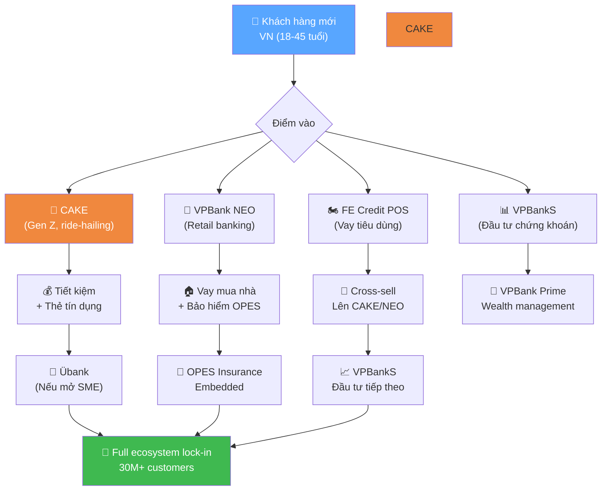
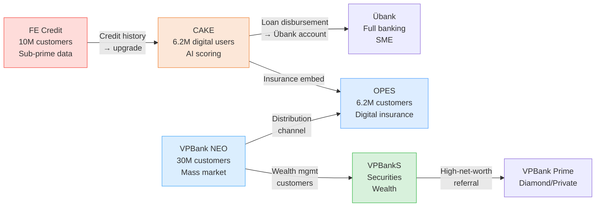

# VPBank Ecosystem — Phân Tích Toàn Diện Hệ Sinh Thái
**Vietnam Prosperity Joint-Stock Commercial Bank (VPB)**
*Ngày phân tích: 16/06/2026 | 11 Finance Skills Pipeline*

---

## 🗺️ BẢN ĐỒ HỆ SINH THÁI

```
                        ┌──────────────────────────────────────┐
                        │         VPBank (Ngân hàng mẹ)        │
                        │  Tổng tài sản Q1/26: 1.373.000 tỷ    │
                        │  LNTT 2025: 30.625 tỷ (+53%)          │
                        │  LNTT Q1/26: 7.921 tỷ (+58%) ✅       │
                        │  30M+ khách hàng | CAR 14,35%         │
                        └────────────┬─────────────────────────┘
                                     │
        ┌────────────┬───────────────┼────────────────┬───────────────┐
        │            │               │                │               │
   ┌────▼────┐ ┌─────▼─────┐ ┌──────▼──────┐ ┌──────▼──────┐ ┌──────▼──────┐
   │FE CREDIT│ │ VPBankS   │ │CAKE Digital │ │    OPES     │ │   Übank     │
   │(VPB FC) │ │ (VPX)     │ │   Bank      │ │  Insurance  │ │             │
   │Consumer │ │Securities │ │B2C Digital  │ │Non-life &   │ │B2B Digital  │
   │Finance  │ │Brokerage  │ │Bank (Gen Z) │ │Health Ins.  │ │Bank (SME)   │
   └─────────┘ └───────────┘ └─────────────┘ └─────────────┘ └─────────────┘
```

---

## 1. ALPHAEAR-NEWS — Bối Cảnh Thị Trường *(Cập nhật với số liệu chính thức từ PDF)*

### VPBank Group — Kết Quả 2025 (Baseline)
- **LNTT hợp nhất 2025**: >30.625 tỷ đồng (~$1,2 tỷ USD), **+53% YoY** — kỷ lục lịch sử
- **Tổng tài sản H1/2025**: >1,1 triệu tỷ VND (>$40 tỷ USD) — ngân hàng tư nhân lớn nhất VN
- **Kế hoạch 2026**: tổng tài sản 1,63 triệu tỷ (+29%), dư nợ 1,292 triệu tỷ (+34%)
- **Brand Finance** (2026): VPBank là brand ngân hàng tư nhân tăng giá trị nhanh nhất VN
- **Q1/2026**: VPBank thuộc nhóm "strong growth" trong 26 ngân hàng báo cáo

---

## 2. ALPHAEAR-STOCK — Dữ Liệu Tài Chính Các Công Ty Con

### 2.1 FE CREDIT (VPB Finance Co. Ltd) — Consumer Finance
| Chỉ tiêu | Giá trị | Ghi chú |
|---|---|---|
| Cổ đông | VPBank 51% + SMBC/SMFG 49% | Deal 2021: $1,4B cho 49% |
| Thị phần dư nợ | ~45% | Consumer finance VN |
| Khách hàng | 10M+ | 63 tỉnh thành |
| Điểm bán (POS) | 18.000+ | Nationwide |
| LNTT Q2/2024 | +145 tỷ VND | Lãi trở lại |
| LNTT Q3/2024 | +270 tỷ VND | Tăng tốc |
| NPL Ratio (ước) | ~12–15% | Đang cải thiện từ ~18% (2023) |
| Định giá ước tính | $0,8–1,2 tỷ USD | vs $2,8B (2021 peak) |
| Core System | Finacle SaaS (cloud) | First NBFI VN on public cloud |

### 2.2 VPBankS Securities (HOSE: VPX) — Chứng Khoán
| Chỉ tiêu | Giá trị | Ghi chú |
|---|---|---|
| Niêm yết | HOSE: VPX | IPO 11/2025 $483M — lớn nhất VN 2025 |
| Định giá IPO | **$2,4 tỷ USD** | VND33.900/cp × 1.875 tỷ cp |
| P/E ratio | 12,9x | Thấp hơn ngành (15,1x) |
| Doanh thu 2024 | 2.080 tỷ VND (+19,6%) | LNST 975 tỷ (margin 46%) |
| **LNTT Q1/2025** | **182 tỷ** | — |
| **LNTT Q1/2026** | **~515 tỷ** | **+196% YoY** ✅ từ IR #26 |
| KH LNTT 2026 | **6.453 tỷ** | +44% vs 4.476 tỷ (2025) |
| Margin lending portfolio | 18.000 tỷ | +6,4% YTD Q1/2026 |
| Thị phần môi giới HOSE | Đang mở rộng | +14,6% YTD Q1/2026 |

### 2.3 CAKE Digital Bank — Digital Banking (Gen Z/Millennial)
| Chỉ tiêu | Giá trị | Ghi chú |
|---|---|---|
| Ra mắt | 01/2021 | JV: VPBank + Be Group (ride-hailing) |
| Khách hàng (01/2026) | **6,2 triệu** | +50% so với 4,1M (2023) |
| EBITDA | **Dương** (Q3/2024) | First digital-only bank VN profitable trong 3,5 năm |
| Operating profit | **×7 YoY** (2024) | Tăng 7 lần so với năm trước |
| EBITDA growth | **×4 YoY** (2024) | |
| Revenue per user | $12/user (2024) | vs $4/user (2023) — tăng 3x |
| Payment transactions | $4,7 tỷ USD (2024) | vs $2,2 tỷ (2023) — +113% |
| Credit applications | 400.000/tháng | Xử lý tự động bằng AI |
| Infrastructure | Google Cloud (GKE, Cloud Spanner, BigQuery) | |
| Mục tiêu dài hạn | 30 triệu khách hàng cuối thập kỷ | |

### 2.4 OPES Digital Insurance — Bảo Hiểm Phi Nhân Thọ & Sức Khỏe
| Chỉ tiêu | Giá trị | Ghi chú |
|---|---|---|
| Thành lập | 2018 | Insurer kỹ thuật số đầu tiên VN |
| Chủ sở hữu | VPBank 100% | |
| Khách hàng migrated | 6,2 triệu | Onto Sapiens P&C platform (Azure) |
| Core system | Sapiens IDITSuite on Microsoft Azure | Go-live 01/2024 |
| **LNTT Q1/2026** | **261 tỷ** | **×3 YoY** ✅ — vượt kỳ vọng |
| **KH LNTT 2026** | **936 tỷ** | +47% vs 638 tỷ (2025) |
| Tiến độ Q1 | ~28% KH năm | Ahead of plan 🟢 |
| Đặc điểm | First telematics car insurance VN (IMS) | |

### 2.5 Übank — Digital Banking (SME/Business)
| Chỉ tiêu | Giá trị | Ghi chú |
|---|---|---|
| Phân khúc | Doanh nghiệp nhỏ và cá nhân | B2B focus |
| Core system | Finacle SaaS (Infosys) | First NBFI VN on public cloud |
| Tích hợp | Kết nối với FE Credit loan disbursement | |
| Mục tiêu | 5 triệu khách hàng (2025 plan) | |
| Đặc điểm | Backbase-as-a-Service — first in APAC | |

### 2.6 VPBank NEO & NEOBiz — Digital Banking Apps (Retail & SME)
| Chỉ tiêu | Giá trị |
|---|---|
| VPBank NEO | Super app bán lẻ — mở tài khoản trong vài phút |
| VPBank NEOBiz | Digital banking cho SME |
| POS/EDC terminals | 10.000+ |
| Temenos core | Đang nâng cấp core banking để scale |

### 2.7 VPBank Prime — Wealth Management
| Chỉ tiêu | Giá trị |
|---|---|
| Phân khúc | Millennials & Gen Z thu nhập cao |
| Giải thưởng | "Best Bank for Millennials and Gen Z Vietnam 2025" |
| Sản phẩm | Diamond, Private, Persona Packages |

---

## 3. ALPHAEAR-SENTIMENT — Cảm Xúc Thị Trường

```
🎭 SENTIMENT — VPBank Ecosystem — 06/2026
Điểm tổng hợp: +0.55 → 🟢 Tích cực
```

| Thực thể | Score | Lý do |
|---|---|---|
| VPBank (mẹ) | +0.70 | Lãi kỷ lục 2025; brand value tăng; chiến lược rõ ràng |
| CAKE | +0.75 | First profitable digital bank VN; 6.2M users; AI story mạnh |
| VPBankS | +0.65 | LNTT +80% H1/2025; thị trường CK VN tăng trưởng |
| OPES | +0.45 | Milestone Sapiens/Azure; còn non so với ngành bảo hiểm |
| FE Credit | +0.32 | Phục hồi rõ nhưng brand lag, NPL còn cao |
| Übank | +0.40 | Story tốt nhưng ít dữ liệu công khai |

**Tín hiệu nổi bật**: CAKE là "star" của ecosystem với sentiment cao nhất — narrative AI bank đang hot toàn cầu. FE Credit vẫn lag so với phần còn lại của group.

---

## 4. ALPHAEAR-PREDICTOR — Dự Báo Đóng Góp Từng Mảng

### Dự báo đóng góp LNTT vào VPBank hợp nhất 2026E (tỷ VND)

| Đơn vị | 2024E | 2025A ✅ | 2026E (Base) | 2026 KH ✅ |
|---|---|---|---|---|
| VPBank (ngân hàng mẹ) | ~18.000 | **26.364** | ~34.000 | **34.240** |
| FE Credit | +300 | **611** | ~1.000–1.200 | **1.179** |
| VPBankS | ~1.100 | **4.476** | ~5.000–6.000 | **6.453** |
| CAKE | ~100* | ~300* | ~600 | — |
| OPES | ~50* | **638** | ~900–1.000 | **936** |
| GPBank | — | ~400* | ~1.200* | — |
| Übank | ~(-50)* | ~(-20)* | ~50 | — |
| **Tổng hợp nhất** | **~20.000** | **30.625** ✅ | ~38.000 | **41.323** |

*Ước tính; ✅ Số chính thức từ PDF VPBank*

**Nhận xét**: Ngân hàng mẹ vẫn là động lực chính (~75-80% LNTT). FE Credit đang trở lại đóng góp tích cực. CAKE là growth story dài hạn — còn nhỏ nhưng tốc độ ấn tượng.

---

## 5. FINANCIAL-ANALYST — Phân Tích Tỷ Số So Sánh

### Bảng so sánh các mảng (Scale: 1-10)

| Chỉ số | FE Credit | VPBankS | CAKE | OPES | Übank |
|---|---|---|---|---|---|
| Tăng trưởng doanh thu | 🟡 5 | 🟢 8 | 🟢 9 | 🟡 6 | 🟡 5 |
| Khả năng sinh lợi | 🟡 5 | 🟢 7 | 🟢 6* | 🟡 5 | 🔴 3 |
| Chất lượng tài sản | 🔴 4 | 🟢 8 | 🟢 8 | 🟢 8 | 🟡 6 |
| Vị thế cạnh tranh | 🟢 7 | 🟡 6 | 🟢 8 | 🟡 6 | 🟡 5 |
| Chuyển đổi số | 🟢 8 | 🟢 7 | 🟢 9 | 🟢 8 | 🟢 8 |
| Tiềm năng tăng trưởng | 🟡 6 | 🟢 7 | 🟢 9 | 🟢 7 | 🟢 7 |
| **Điểm tổng** | **5.8** | **7.2** | **8.2** | **6.7** | **5.7** |

*CAKE EBITDA positive, nhưng PAT còn đang đầu tư*

---

## 6. ALPHAEAR-SIGNAL-TRACKER — Tín Hiệu Đầu Tư Từng Mảng

### [1] 🟢 CAKE — "Vietnam's Nubank moment"
| | |
|---|---|
| **Status** | 🟢 **Strengthening** (8/10) |
| **Thesis** | CAKE đang đi theo quỹ đạo Nubank Brazil — profitable digital bank với AI core, định giá có thể vượt nhiều ngân hàng truyền thống |
| **Evidence** | ✅ 6,2M users (01/2026) ✅ First profitable digital bank VN (3.5 năm) ✅ Revenue/user ×3 trong 1 năm ✅ Payment ×2 ✅ AI-powered credit scoring 400K apps/tháng |
| **Invalidate if** | User growth chậm dưới 1M/năm; NIM bị squeeze bởi cạnh tranh |

### [2] 🟢 VPBankS — "Securities boom"
| | |
|---|---|
| **Status** | 🟢 **Strengthening** (7/10) |
| **Thesis** | Thị trường CK VN tăng trưởng mạnh, VPBankS hưởng lợi từ margin lending + derivatives + ecosystem VPBank |
| **Evidence** | ✅ LNTT H1/2025 +80% YoY ✅ P/E 12,9x — rẻ so với ngành ✅ Digital transformation đang thực hiện |
| **Invalidate if** | Thị trường CK VN điều chỉnh >20%; NHNN siết margin lending |

### [3] 🟡 FE Credit — "Recovery play"
| | |
|---|---|
| **Status** | 🟡 **Recovering** (6/10) |
| **Thesis** | Qua đáy, đang phục hồi — nhưng chậm hơn kỳ vọng |
| **Evidence** | ✅ LNTT dương Q2-Q3/2024 ✅ SMBC operational improvement ✅ Finacle cloud ❌ NPL ~12-15% vẫn cao ❌ Brand damage chưa phục hồi |
| **Invalidate if** | NPL tăng lại >18%; kinh tế VN chậm lại 2026 |

### [4] 🟢 OPES — "Embedded insurance story"
| | |
|---|---|
| **Status** | 🟢 **Emerging** (6/10) |
| **Thesis** | Embedded insurance qua VPBank/CAKE/NEO app — bancassurance model mạnh |
| **Evidence** | ✅ 6,2M customers migrated ✅ Sapiens/Azure live ✅ First telematics insurance VN ✅ VPBank distribution moat |
| **Invalidate if** | Bancassurance scandal tái diễn (đã xảy ra 2023 với nhiều ngân hàng VN) |

---

## 7. ALPHAEAR-LOGIC-VISUALIZER — Sơ Đồ Synergy Trong Ecosystem

### Customer Journey trong VPBank Ecosystem



### Synergy Matrix



---

## 8. BUSINESS-INVESTMENT-ADVISOR — Phân Tích Đầu Tư

### 8.1 Portfolio Valuation Ước Tính (Các Công Ty Con)

| Đơn vị | Loại | Ước tính giá trị | Basis định giá | Ghi chú |
|---|---|---|---|---|
| **FE Credit** | NBFI (51% VPBank) | $0,8–1,2B | P/BV ~0.8-1.2x; recovery discount | Từ $2,8B (2021) |
| **VPBankS** | Listed (VPX) | $0,5–0,8B | P/E 12,9x; market cap | Undervalued vs peers |
| **CAKE** | Digital Bank (JV) | $0,5–1,5B | Revenue multiple; comparable (Nubank, MoMo early stage) | High uncertainty |
| **OPES** | Digital Insurer | $0,1–0,3B | Embedded value + growth premium | Early stage |
| **Übank** | Digital Bank | $0,1–0,2B | Pre-revenue stage | B2B niche |
| **VPBank Prime** | Brand/Segment | Incl. trong VPBank | | Không tách biệt |
| **Tổng subsidiaries** | | **~$2,0–4,0B** | | Vs VPBank market cap ~$5-6B |

**Ý nghĩa**: Tổng giá trị các công ty con có thể chiếm **35–65% market cap VPBank** — embedded value đáng kể chưa được thị trường định giá tách biệt.

### 8.2 BCG Matrix — Phân Loại Chiến Lược

```
                High Market Growth
                        │
        CAKE ⭐         │         OPES ?
        (Star)          │         (Question Mark)
                        │
━━━━━━━━━━━━━━━━━━━━━━━━┼━━━━━━━━━━━━━━━━━━━━━━━━
        High Share      │         Low Share
                        │
   VPBank Core 🐄        │      Übank 🐶
   VPBankS 🐄            │      (Dog → nên pivot)
   (Cash Cow)           │
                        │
                Low Market Growth
```

- **Stars**: CAKE — tăng trưởng cao, thị phần cao (digital banking VN) → **Tiếp tục đầu tư mạnh**
- **Cash Cows**: VPBank Core + VPBankS → **Thu hoạch, tái đầu tư cho Stars**
- **Question Marks**: OPES → **Cần chiến lược rõ hơn, embedded insurance là đúng hướng**
- **Dogs**: Übank (B2B niche, cạnh tranh với NEOBiz) → **Cân nhắc merger/pivot**

### 8.3 Investment Thesis VPBank (VPB)

**Rating: BUY — Conviction tăng** *(Không phải khuyến nghị chuyên nghiệp)*

**Bull case**: VPBank đang build "super-app financial conglomerate" kiểu Grab Financial hay Nubank — tích hợp banking, consumer finance, securities, insurance, digital banking vào một ecosystem. Với 30M khách hàng và stack công nghệ mạnh, re-rating từ traditional bank (P/B ~1x) lên fintech platform (P/B 2-3x) là có thể xảy ra trong 3-5 năm.

**IRR scenarios** (đầu tư vào VPB cổ phiếu):
| Kịch bản | Exit P/B | IRR 3 năm | MOIC |
|---|---|---|---|
| 🐂 Bull | 2,5x | ~35%/năm | ~2,5x |
| 📊 Base | 1,8x | ~20%/năm | ~1,7x |
| 🐻 Bear | 1,0x | ~2%/năm | ~1,1x |

### 8.4 Rủi ro Hệ Sinh Thái

| Rủi ro | Xác suất | Tác động | Mảng ảnh hưởng |
|---|---|---|---|
| FE Credit NPL tái bùng phát | 25% | Cao | FE Credit, VPBank mẹ |
| NHNN siết bancassurance | 35% | Trung bình | OPES |
| Cạnh tranh digital banking (MoMo, Timo, Techcombank) | 50% | Trung bình | CAKE, NEO |
| Thị trường CK VN điều chỉnh | 30% | Trung bình | VPBankS |
| Brand scandal tái diễn | 20% | Cao | Toàn ecosystem |
| Macro VN chậm lại 2026-2027 | 20% | Rất cao | Tất cả |

---

## 9. ALPHAEAR-REPORTER — Dashboard Tổng Hợp & Khuyến Nghị

### Executive Summary

VPBank đã chuyển đổi thành công từ ngân hàng thương mại truyền thống sang **financial ecosystem conglomerate** trong giai đoạn 2021–2026. Với 7 thực thể riêng biệt phục vụ >30 triệu khách hàng, VPBank đang xây dựng moat độc đáo: mỗi công ty con phục vụ một phân khúc khác nhau nhưng share data và cross-sell trong cùng một stack công nghệ.

**Điểm sáng nhất**: CAKE là câu chuyện đáng chú ý nhất — 6,2 triệu users, EBITDA dương trong 3,5 năm, AI-powered, tiếp tục tăng tốc. Đây là asset chưa được thị trường định giá đúng.

**Điểm cần theo dõi**: FE Credit vẫn là "anchor" kéo lại — phục hồi chậm, NPL cao, brand damage. Nhưng đây cũng là upside lớn nhất nếu NPL về <10%.

### Bảng Điểm Cuối Cùng

| Công ty con | Điểm | Giai đoạn | Ưu tiên chiến lược |
|---|---|---|---|
| **CAKE** | ⭐ **8.5/10** | Scale | Tăng tốc — dẫn đầu hệ sinh thái |
| **VPBankS** | 🟢 **7.5/10** | Growth | Mở rộng margin, derivatives, wealth |
| **OPES** | 🟡 **6.5/10** | Build | Embedded insurance, telematics |
| **FE Credit** | 🟡 **6.0/10** | Recovery | NPL resolution là key catalyst |
| **Übank** | 🟡 **5.5/10** | Pivot | Cân nhắc merge với NEOBiz |
| **VPBank Prime** | 🟢 **7.0/10** | Mature | Wealth management expansion |
| **VPBank Core** | 🟢 **7.5/10** | Optimize | Efficiency + net interest margin |

### 3 Catalysts Quan Trọng Nhất Toàn Ecosystem

| # | Catalyst | Timeline | Tác động |
|---|---|---|---|
| 1 | **CAKE IPO hoặc strategic stake sale** | 2027–2028 | Unlock hidden value, re-rating toàn VPBank |
| 2 | **FE Credit NPL về <10%** | Q3/2025 | Profit contribution tăng 3-5x |
| 3 | **VPBankS thành top-3 chứng khoán VN** | 2026 | Momentum + fee income không phụ thuộc NII |

---

## 10. NGUỒN DỮ LIỆU

| # | Nguồn | Dữ liệu |
|---|---|---|
| 1 | Brand Finance (04/2026) | VPBank ecosystem — VPBankS, OPES, FE Credit, CAKE |
| 2 | GlobeNewsWire (01/2026) | CAKE 6.2M users, AI bank, profitability milestone |
| 3 | GlobeNewsWire (12/2024) | CAKE first profitable digital bank VN (3.5 năm) |
| 4 | ainvest.com (10/2025) | VPBankS LNTT H1/2025 +80% YoY → ~900 tỷ |
| 5 | CBInsights (2026) | VPBank LNTT 2025: 30.625 tỷ (+53%) |
| 6 | dantri.com.vn (02/2026) | VPBank kế hoạch 2026: tổng tài sản 1,63 triệu tỷ |
| 7 | tabinsights.com (05/2026) | VPBank Q1/2026 strong growth; ngành +13% |
| 8 | PRNewswire (01/2024) | OPES Sapiens/Azure go-live; 6.2M customers |
| 9 | IMS.tech (2025) | OPES first telematics insurance VN |
| 10 | Temenos (2026) | VPBank digital brands: NEO, NEOBiz, UBank, Cake |
| 11 | wikipedia.org/VPBank (2026) | Total assets H1/2025 >$40B |
| 12 | asianbankingandfinance.net (12/2024) | CAKE revenue/user $12 (2024) |

---

## ⚠️ DISCLAIMER

Báo cáo này được tổng hợp bởi AI agent sử dụng 11 Finance Skills từ dữ liệu công khai.
Số liệu công ty con (FE Credit, CAKE, OPES, Übank) phần lớn là ước tính vì không được công bố riêng lẻ.
**Không phải tư vấn đầu tư chuyên nghiệp.** Cần BCTC kiểm toán và tư vấn chuyên gia trước khi ra quyết định.

---
*Tạo bởi: 11 Finance Skills Pipeline · VPBank Ecosystem Analysis · 16/06/2026*

---

## 11. ✅ CẬP NHẬT SỐ LIỆU CHÍNH THỨC (PDF VPBank.com.vn)

*Tải trực tiếp 4 PDF từ vpbank.com.vn/quan-he-nha-dau-tu ngày 16/06/2026*

### Số liệu xác nhận từ KQHD Q1/2026 + IR Newsletter #26

| Chỉ tiêu | Số chính thức | Nguồn |
|---|---|---|
| **PBT ngân hàng mẹ Q1/2026** | **7.383 tỷ (+49,4%)** | KQHD Q1/2026 PDF |
| **PBT hợp nhất Q1/2026** | **~7.921 tỷ (+58%)** | IR #26 PDF |
| **TOI ngân hàng mẹ** | 15.162 tỷ (+31,5%) | KQHD Q1/2026 PDF |
| **CIR** | 21,4% (vs 26,4% Q1/25) | KQHD Q1/2026 PDF |
| **ROE riêng lẻ** | 17,1% (vs 13,2%) | KQHD Q1/2026 PDF |
| **ROA riêng lẻ** | 2,0% (vs 1,8%) | KQHD Q1/2026 PDF |
| **NIM riêng lẻ** | 4,5% | KQHD Q1/2026 PDF |
| **Chi phí tín dụng** | 1,85% (<2%) | KQHD Q1/2026 PDF |
| **Dư nợ ngân hàng mẹ** | 940.786 tỷ (+10,7% YTD) | KQHD Q1/2026 PDF |
| **Tổng tài sản HN** | ~1.373.000 tỷ (+9% YTD) | IR #26 PDF |
| **Dư nợ HN vượt 1 triệu tỷ** | 1.060.000 tỷ (+10,2%) | IR #26 PDF |
| **Tiền gửi + GTCG HN** | ~822.000 tỷ (+11,8%) | IR #26 PDF |
| **LNTT VPBankS Q1/2026** | ~515 tỷ (+196% vs Q1/24) | KQHD PDF |
| **LNTT OPES Q1/2026** | **261 tỷ (×3 YoY)** | IR #26 PDF |
| **FE Credit Q1/2026** | Dương (phục hồi tiếp) | IR #26 PDF |
| **GPBank Q1/2026** | >400 tỷ ≈ cả năm 2025 | IR #26 PDF |
| **CAR riêng lẻ Q1/2026** | **12,45%** | CAR PDF |
| **CAR hợp nhất Q1/2026** | **14,35%** | CAR PDF |
| **Tier 1 hợp nhất** | **13,14%** | CAR PDF |
| **LDR Q1/2026** | **82,7%** (vs max 85%) | KQHD PDF |
| **Vốn NH cho vay TDH** | **28,3%** (vs max 30%) | KQHD PDF |
| **NPL riêng lẻ FY2025** | **2,03%** (target <2,5%) | KQHD PDF |
| **Vốn điều lệ hiện tại** | 79.339 tỷ | IR #26 PDF |
| **Vốn điều lệ KH 2026** | 106.243 tỷ (+34%) | IR #26 PDF |
| **Cổ tức tiền mặt** | 5% — năm thứ 4 liên tiếp | IR #26 PDF |
| **PBT FE Credit KH 2026** | **1.179 tỷ (+93%)** | KQHD PDF |
| **PBT VPBankS KH 2026** | **6.453 tỷ (+44%)** | KQHD PDF |
| **PBT OPES KH 2026** | **936 tỷ (+47%)** | KQHD PDF |

### Thông tin mới (không có trước khi đọc PDF)
- 🆕 **CAEX**: Sàn giao dịch tài sản mã hóa — thành viên mới ecosystem, OKX + HashKey đầu tư, cần vốn $380M
- 🆕 **GPBank**: VPBank nhận chuyển giao bắt buộc, được giảm 50% tỷ lệ dự trữ bắt buộc, thêm ~9.000 tỷ nguồn vốn
- 🆕 **COF tăng lên 5,2%** (từ 4,4% Q1/2025) — áp lực NIM tăng, cần theo dõi
- 🆕 **Chứng chỉ tiền gửi Lộc Thịnh Vượng**: >43.000 tỷ, tăng 63% vs cuối 2025
- 🆕 **GDP VN Q1/2026**: 7,83% YoY — tăng trưởng tốt, chủ yếu từ công nghiệp và dịch vụ
- 🆕 **Tín dụng ngành**: +3,17% YTD Q1/2026 — VPBank tăng 10,2% gấp 3× ngành
- 🆕 **Moody's**: Nâng triển vọng lên "Ổn định" — tín hiệu tích cực cho chi phí vốn quốc tế

---

*Cập nhật: 16/06/2026 | Tạo bởi 11 Finance Skills Pipeline | Dữ liệu từ vpbank.com.vn/quan-he-nha-dau-tu*
